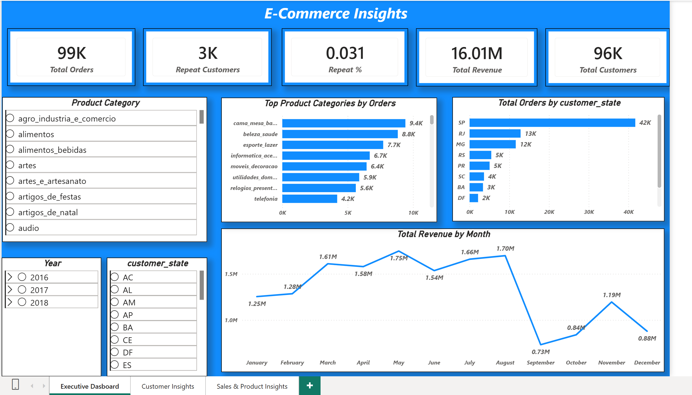
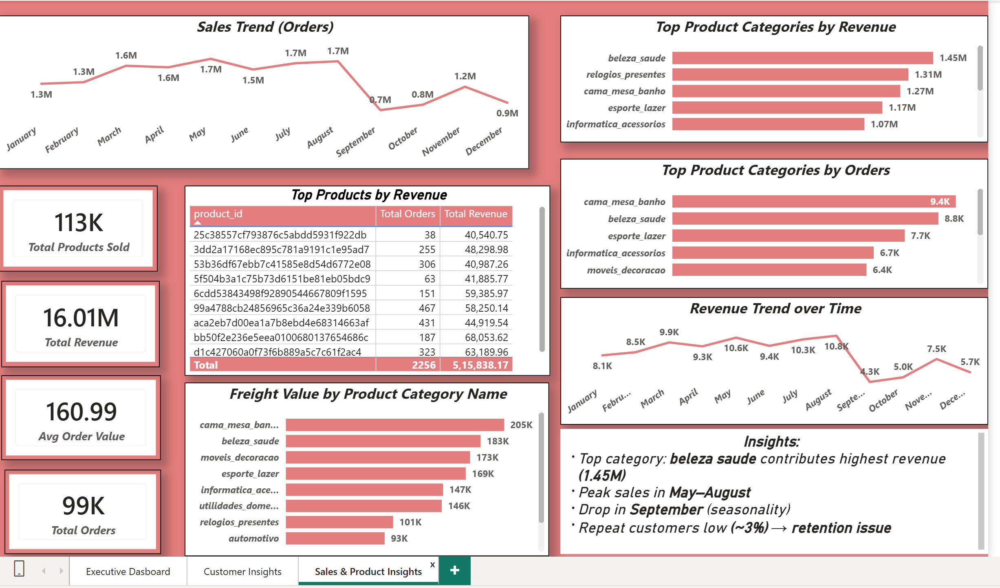

E-Commerce Sales & Customer Analytics Dashboard

##  Project Overview

This project presents an end-to-end **data analytics solution** for an e-commerce business using **SQL, Python, and Power BI**. The goal was to analyze sales performance, customer behavior, and product trends to generate actionable business insights.

The dataset contains **100K+ orders**, including customer details, product information, payments, and order items.

---

##  Objectives

* Analyze **sales trends over time**
* Identify **top-performing product categories**
* Understand **customer behavior (new vs repeat)**
* Evaluate **revenue distribution**
* Provide **data-driven business insights**

---

##  Tech Stack

* **SQL (Microsoft SQL Server)** → Data extraction & transformation
* **Python (Pandas, Matplotlib)** → Data cleaning & analysis
* **Power BI** → Dashboard creation & visualization

---

## Dataset Description

The dataset consists of multiple tables:

* orders → Order details & timestamps
* order_items → Product-level transaction data
* customers → Customer information
* products → Product categories & attributes
* order_payments → Payment details

---

##  Data Processing Workflow

### 1️SQL (Data Preparation)

* Imported CSV data into SQL Server
* Performed joins between tables
* Cleaned inconsistent data types
* Aggregated:

  * Monthly revenue
  * Order counts
  * Customer metrics

---

### 2️ Python (Data Analysis)

* Handled missing values
* Performed exploratory data analysis (EDA)
* Generated insights such as:

  * Monthly revenue trends
  * Customer spending patterns
* Exported clean datasets for Power BI

---

### 3️ Power BI (Visualization)

Created **3 interactive dashboards**:

---

##  Dashboards

### 1️ Executive Dashboard

* Total Orders: **99K+**
* Total Revenue: **16M+**
* Total Customers: **96K+**
* Repeat Customers: **~3K (~3%)**
* Revenue trends over time
* Orders by region and category

---

### 2️ Customer Insights

* Customer segmentation (New vs Repeat)
* Repeat customer rate
* Average revenue per customer
* Customer growth trends
* Top customers by revenue

---

### 3️ Sales & Product Insights

* Top product categories by revenue
* Top categories by orders
* Sales trends (monthly)
* Revenue trends
* Shipping (freight) analysis
* Top products by revenue

---

##  Key Insights

*  **Top category**: *beleza_saude* generated highest revenue (~1.45M)
*  Sales peak observed between **May–August**
*  Significant drop in **September (seasonality impact)**
* **Repeat customers only ~3%** → major retention opportunity
*  Few categories contribute majority of revenue (Pareto effect)

---

##  Business Recommendations

*  Improve **customer retention strategies** (loyalty programs, offers)
*  Optimize **inventory for top-performing categories**
*  Investigate **September sales drop** (seasonal or operational issue)
*  Reduce **shipping costs** in high freight categories
*  Focus marketing on **high-value customers**

---

##  Skills Demonstrated

* Data Cleaning & Transformation
* SQL Joins & Aggregations
* Exploratory Data Analysis (EDA)
* Data Modeling (Power BI)
* DAX Measures (KPIs, ratios)
* Business Insight Generation
* Dashboard Design & Storytelling

---

##  Dashboard Preview

###  Executive Dashboard

###  Customer Insights

###  Sales & Product Insights

---

##  Conclusion

This project demonstrates how raw data can be transformed into meaningful insights using a combination of **SQL, Python, and Power BI**. It highlights the importance of data-driven decision-making in improving business performance.

---

##  Let's Connect

If you're looking for a **Data Analyst** who can turn data into actionable insights, feel free to connect with me!

---
